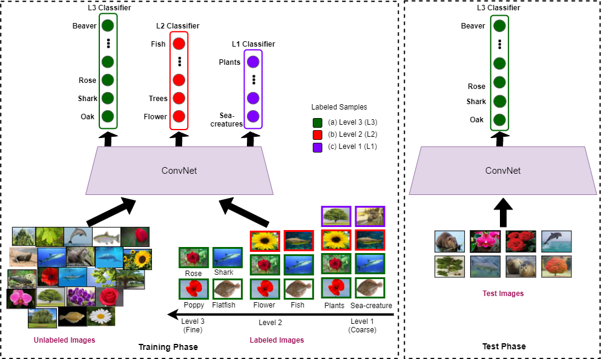

# PyTorch Implementation of HIERMATCH 

Official Code release for **[HIERMATCH: Leveraging Label Hierarchies for Improving Semi-Supervised Learning](https://arxiv.org/pdf/2111.00164.pdf)** <br/>
Ashima Garg, Shaurya Bagga, Yashvardhan Singh, Saket Anand. <br />
_IEEE Winter Conference on Applications of Computer Vision (WACV 2022)_ <br/>

## Citations
If you find this paper useful, please cite our paper: 

## Proposed HIERMATCH
<div align="center">
  
</div>

## Using the Code
HIERMATCH approach is tested on **CIFAR-100** and **North American Birds** Dataset. <br/>

- To run HIERMATCH on CIFAR-100 (for level-2 and level-3)
  - With samples from finest-grained level only and no additional samples from coarser-levels, use the code folder in ```HIERMATCH-cifar-100/```
  - With samples from finest-grained level and partial-labeled samples from coarser-levels, use the code folder in ```HIERMATCH-cifar-100-partial/```.

- To run HIERMATCH on NABirds (for level-2 and level-3)
  - With samples from finest-grained level only and no additional samples from coarser-levels, use the code folder in ```HIERMATCH-nabirds/```
  - With samples from finest-grained level and partial-labeled samples from coarser-levels, use the code folder in ```HIERMATCH-nabirds-partial/```.

Use the command in the respective folders: ```python train.py```

## Installation
Clone the repository
```
$ git clone https://github.com/07Agarg/HIERMATCH
$ cd HIERMATCH
```

## Acknowledgements
The codebase is borrowed from [MixMatch](https://github.com/YU1ut/MixMatch-pytorch)

## Contact 
If you have any suggestion or question, you can leave a message here or contact us directly at ashimag@iiitd.ac.in
